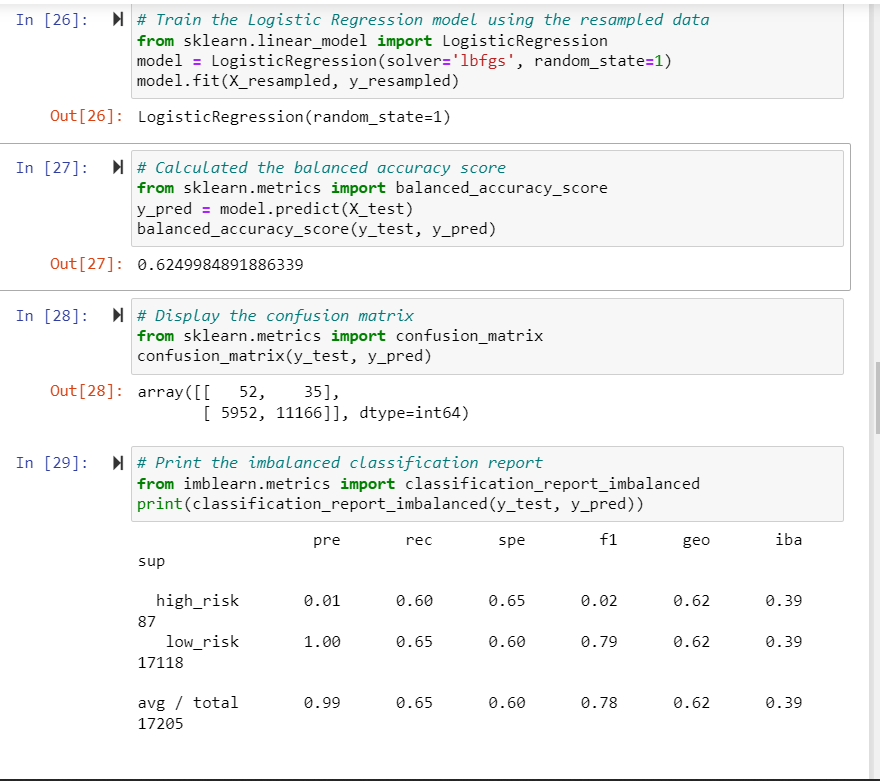
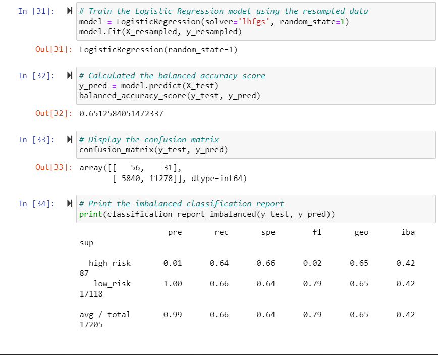
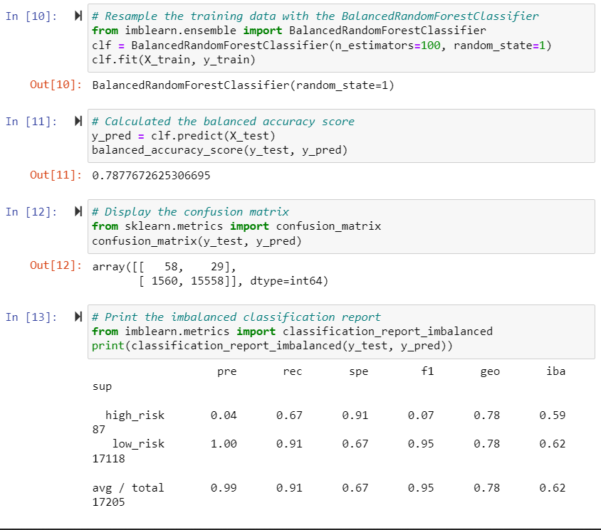
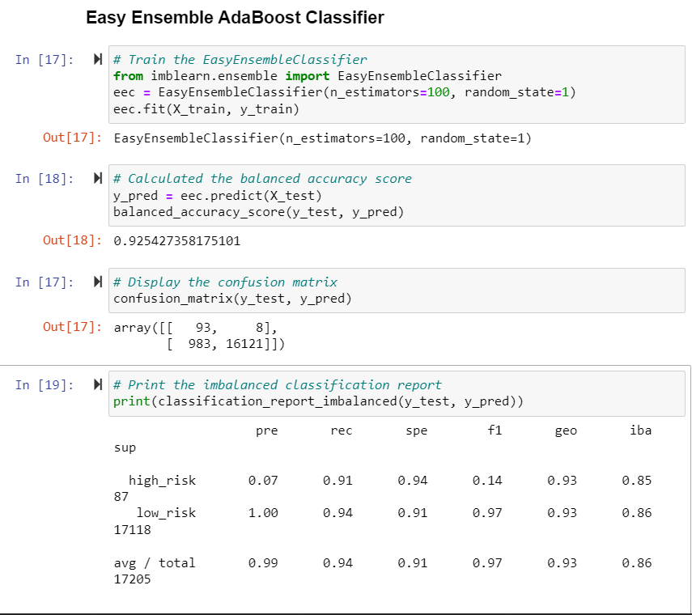

# Credit_Risk_Analysis
## Overview 
The purpose of this analysis is to use different techniques to train and evaluate models with unbalanced classes. I used imbalanced-learn and scikit-learn libraries to build and evaluate models using resampling 
---

## Results
### Naive Random Oversampling 

- Balanced Accuracy: 0.6249984891886339
- Precision is low for high risk loans, and high for low risk loans
- Recall: High/Low = .60/.65

### SMOTE Oversampling

- Balanced Accuracy: 0.6512584051472337
- Precision is low for high risk loans, and high for low risk loans
- Recall: High/Low = .64/.66

### Balanced Random Forest Classifier

- Balanced Accuracy: 0.7877672625306695
- Precision is low for high risk loans, and high for low risk loans
- Recall: High/Low = .67/.91

### Easy Ensemble AdaBoost Classifier

- Balanced Accuracy: 0.925427358175101
- Precision is low for high risk loans, and high for low risk loans
- Recall: High/Low = .91/.94

---
## Summary
For this data set, I recommend the Easy Ensemble AdaBoost Classifier model since it has the highest balanced accuracy whereas the other models were much lower. Also, it had the highest recall score. Although precision was consistent throughout each model, I still recommend Easy Ensemble AdaBoost Classifier as the best choice foe this data.
